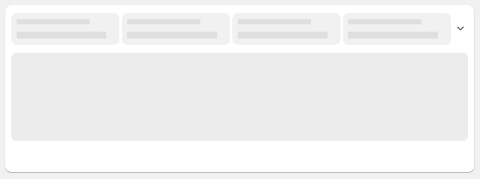
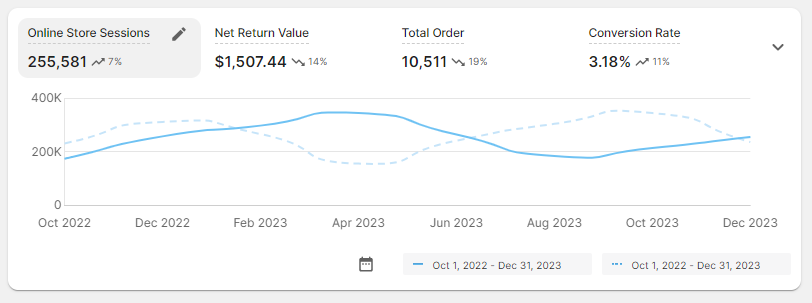
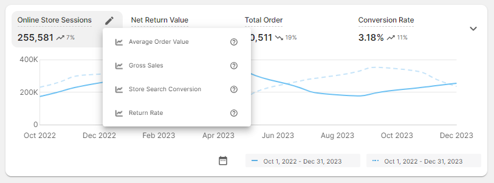
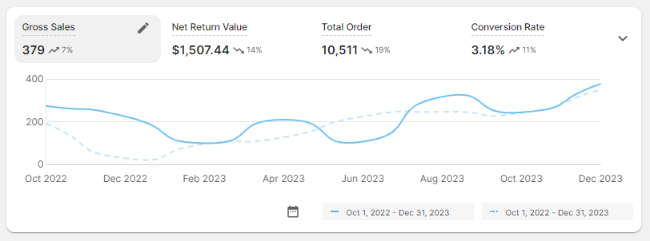
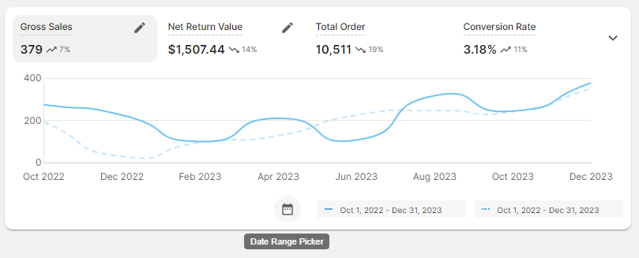
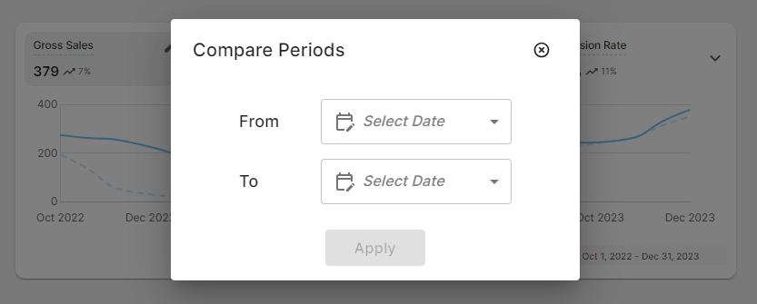
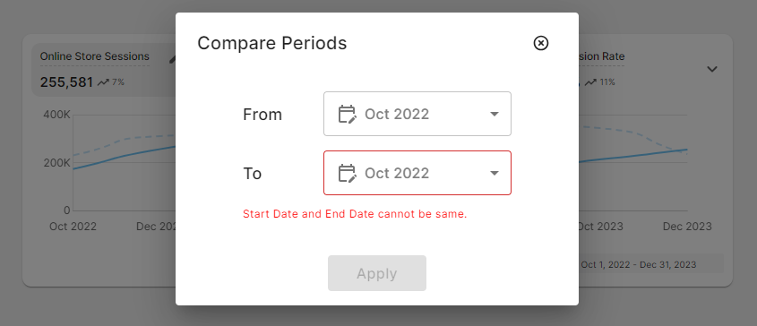
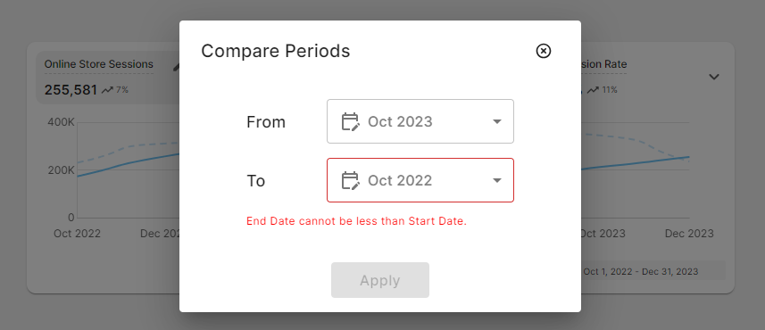
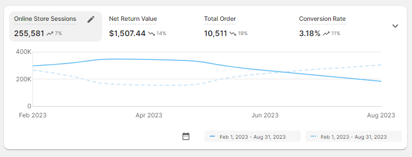
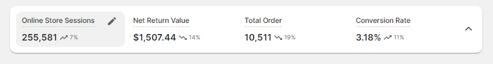

# Overview

Go Marble dashboard application built on React using Material-UI which offers a modern and flexible solution for creating interactive and visually appealing user interfaces for data visualization and state management. It leverages the strengths of React's component-based architecture and Material-UI's rich set of UI components to deliver a compelling user experience.

## Project timeline

Built Go Marble Dashboard application within 10 days to showcase the following:

* My technical skill set
* My web design skill set

## Technologies Used

* HTML5
* CSS3
* JavaScript (ES6)
* React
* Redux
* Material-UI
* Chart.JS
* React Chart.JS 2
* Git
* GitHub

## Folder Structure

```
.
├── node_modules
├── public
│   └── index.html
├── src
|   ├── assets
│   │   └── ...
|   ├── components
│   │   ├── Chart
|   │   │   ├── ChartData.js
|   │   │   ├── ChartLoading.js
|   │   │   ├── index.js
|   │   │   └── LineChart.js
│   │   ├── DateFrame
|   │   │   ├── DateData.js
|   │   │   ├── DateFrame.js
|   │   │   ├── index.js
|   │   │   └── SelectDateDialog.js
│   │   └── Metrics
|   │       ├── index.js
|   │       ├── MetricsData.js
|   │       ├── MetricsLoading.js
|   │       └── MetricsMenu.js
|   ├── data
│   │   └── MainContext.js
|   ├── pages
│   │   └── MarbleDashboard.js
|   ├── state
│   │   ├── actions.js                  # Redux actions
│   │   ├── appLoadReducers.js
│   │   ├── dateRangeReducers.js
│   │   ├── indexReducers.js
│   │   ├── rootReducer.js              # Redux reducer
│   │   └── store.js                    # Redux Store
|   ├── utils
│   │   ├── constants.js
│   │   ├── function-definitions.js
│   │   └── mock-data.json
|   ├── App.js
|   └── index.js                        # Root component
├── .gitignore
├── package-lock.json
└── package.json

```

## Installation

To get started with this project, follow these steps:

1. Clone the repository: 
```bash
git clone https://github.com/amit-jaggi/marbleDashboard.git
```

2. Navigate to the Project Directory
```bash
cd marbleDashboard
```
3. Install dependencies:
```bash
npm install
```

## Usage

To run the development server, use the following command:

```bash
npm start
```
This command will compile your React application and open it in a development server. By default, the server runs on ```http://localhost:3000```

# Implementation Decisions

While building Go Marble Dashboard application, there are several key implementation decisions & approaches taken into consideration which played significantly impact on the performance, scalability, and maintainability of the application. Here are some important implementation decisions:

1. ```Component Structure```: Deciding on the structure of React components which was the crucial part for organizing the application. It helped to determine how to break down the user interface into reusable components that encapsulate specific functionality.

2. ```State Management```: Choosing the right state management approach was important for managing the application's data and state changes. While building Go Marble Dashboard application I opted with an external libraries which was ```Redux``` for handling complex state management requirements.

3. ```Styling```: Choosing the appropriate version of ```Material-UI``` a third-party library for the current project. Material-UI provides various components and utilities for building current applications with Material Design principles. It offers multiple styling approaches, including CSS-in-JS solutions like makeStyles, styled-components, and @emotion/styled.

4. ``` Graphical Representation```: The decision to use ```Chart.js``` & ```React Chart.js 2``` as the charting library in current application was a crucial approach. It offers a wide range of chart types, customization options, and good documentation, making it a popular choice for graphical data visualization in web applications.

5. ```Deployment```: Choosing the right deployment strategy depends on factors like availability and ease of maintenance. There were various platforms to host the application but I made a choice to go with ```Netlify``` static file for hosting. 

# Netlify Host Link

```bash
Link: https://gomarble.netlify.app/
```

# Snapshots

```
Dashboard Snapshot 1: Application is getting loaded
```



```
Dashboard Snapshot 2: Display's data after the loading gets completed
```


```
Dashboard Snapshot 3: Display's drop-down menu on clicking edit button  
```


```
Dashboard Snapshot 4: Display's the selected metric data from the drop-down menu
```


```
Dashboard Snapshot 5: Display's ToolTip message on hovering the Date Range Picker button
```


```
Dashboard Snapshot 6: Display's Compare Period dialog box with Apply button disabled
```


```
Dashboard Snapshot 7: If user selects same date's from the drop-down menu then it thows an error alongwith Apply button remaining disabled
```


```
Dashboard Snapshot 8: If user selects end date less than the start date from the drop-down menu then it thows an error alongwith Apply button remaining disabled
```


```
Dashboard Snapshot 9: If user provides start date less than the end date from the drop-down menu then the Apply button gets enabled and without any error.
```


```
Dashboard Snapshot 10: Display's the filtered line graph based on the user selected comparison periods
```


```
Dashboard Snapshot 11: Functionality of drop-down arrow button is use to collapse the displaying chart data on click and vise-verse
```


```
Dashboard Snapshot 12: Display's the Metrics Tooltip message on hovering over the Metrics heading which is next to edit button
```


## Author

Amit Jaggi
### Connect With Me
[](https://www.linkedin.com/in/amit-jaggi-175781134/)